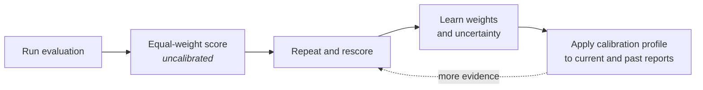

# High-Level Calibration Workflow

```mermaid
flowchart LR
    A["Run evaluation"] --> B["Equal-weight score<br/><i>uncalibrated</i>"]
    B --> C["Repeat and rescore"]
    C --> D["Learn weights<br/>and uncertainty"]
    D --> E["Apply calibration profile<br/>to current and past reports"]
    E -. more evidence .-> C
```

